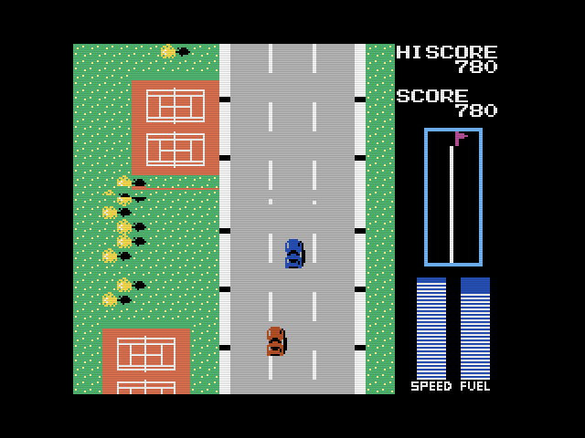

# Road Fighter WAVE

This repository contains a patch to the original Road Figher game, released by Konami for [MSX](https://en.wikipedia.org/wiki/MSX) computers.  

## 🛠️ Project Description

The **patch** provided in this project is meant to be applied to the original game ROM and it will add new music in WAVE format, replacing the original PSG music. A complete set with SIX new songs was made to this game (one to each level of the game). The original songs (played at game over, start and end of the race, were also rearranged ).  

In order to hear the new wave soundtrack, the patched game should be used with a [MSX Pico+ cartridge](https://www.msxpico.com/), made by Jeroen Taverne. It requires the latest firmware released in MSX Pico website.

Current version of this patch is v. 1.1.

Some features added to the original game:

- Sound test screen, activated pressing ESC in the credits screen.
- A new MSX palette, with better colors, added when running in a MSX2 computer.
- Pause, pressing F1 during gameplay.
- SFX engine volume control, pressing INS (+) and DEL (-).

Sound effects remain being played by PSG. SFX engine volume starts in a reduced level.  

## hash

The file to be patched must have the following hash:

**SHA256**:   `6d36c9e9b6a6b93f642722dcd314834d01e519ab3a98d7e4ca257468bcaf29e1`

**SHA1**:     `7abdf08e9c0a511b8182c502ed8c5f42778437e9`

**MD5**:      `8ae5b5c13f45321f555ab1103092ad76`

The patch can be applied with any patcher software that supports the IPS file format, e.g. Lunar IPS.

## How to use

After applying the patch, copy the wav files of the desired music set and the patched ROM to a folder in the sd card of your MSX Pico cartridge. 

Turn on your MSX with your Pico cartridge connected, and using Pico menu, navigate until the folder with the files and execute the game.

## Credits

- **Original Game**: "Road Fighter" 
- **Original Publisher**: Konami 
- **Platform**: MSX
- **Patch programmer**: Maurício Braga 
- **WAVE musics**: produced by Wolf (2025). 

MSX Pico cartridge made by Jeroen Taverne.

## Thanks

- Wolf.
- Jorrith Schaap.
- Riva Lima.
- Jeroen Taverne.
- Stefano Baldo.
- Pedro de Medeiros.
- OpenMSX team.
- Randam
- Patriek Lesparre (TNI).
- Albert Beevendorp (TNI).

## Legal notice

This repository is provided "as is" to owners of an original copy of the game. All rights to the original game remain to the original publisher and the original developers. 

The use of this repository might be illegal if you do not own an original copy of the game.

Also, the repository will be removed if the  original publisher or their legal representatives ask me to do so.
